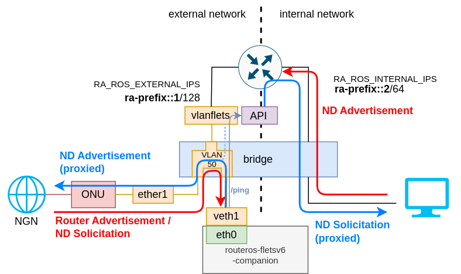

本プログラムは、RouterOS Container上で動作させることで、フレッツ光IPv6への接続を補助できるユーティリティです。

# 機能


- Router Advertisement受信機能
  - Router Advertisementの受信(プレフィックス・ゲートウェイ)
    - 受信したプレフィックスは他の機能の設定時に利用可能
  - RouterOSへの各種設定反映機能
    - デフォルトゲートウェイの設定
    - インターフェースへのIPv6アドレス付与
    - IPv6 Poolへのプレフィックスの登録
- Neighbor Discoveryプロキシ(NDProxy)機能
  - 外部からの近隣要請への代理応答
    - 任意のソースMACアドレスを用いて応答可能
  - 複数の代理問い合わせ方式
    - 特定のネットワーク範囲に常に応答(static)
    - 内部ネットワークへ近隣要請を送信(proxy)
    - RouterOS APIを利用したRouterBoardからの近隣要請(proxy-ros)
  


# 構成例



この構成例では、RouterOSからpingを送信させることでNeighbor Discoveryを行う方式を利用します。
内部ネットワークをコンテナに接続する必要がないため、インターフェースの設定が簡単になります。

以下にこの構成を準備するための手順を示します。

### 必要なインターフェースの準備

まず、外部ネットワークと内部ネットワークを分割するため、Bridge VLAN Filteringを用いて外部ネットワーク用のVLANを準備します。

※ Bridge VLAN Filteringの利用を推奨しますが、複数のBridgeを用いた分割でも動作させることは可能です

今回は、ブリッジ`bridge`に全てのデバイスを所属させており、うち`ether1`を外部ネットワークに接続するものとします。
また、内部ネットワークをVLAN ID 1(Native)に、外部ネットワークをVLAN ID 50に割り当てます。

以下のコマンドにより外部ネットワーク用のVLAN(ID=50)を準備します。

```sh
/interface/bridge/port/set numbers=[find interface=ether1] pvid=50 # ether1のnative vlan(PVID)を50に変更
/interface/bridge/vlan/add bridge=bridge vlan-ids=50 tagged=bridge # vlan 50のパケットをCPU Portに出力
/interface/vlan/add name=vlanflets interface=bridge vlan-id=50
```

次に、companionを接続させるためのVETHデバイスを作成し、VLAN50に接続します。
また、RouterOS APIにアクセスできるように、IPアドレスとゲートウェイを適切に設定します。

```sh
/interface/veth/add name=veth1 address=172.18.0.2/24 gateway=172.18.0.1
/interface/bridge/port/add bridge=bridge interface=veth1 pvid=50
/ip/address/add interface=vlanflets address=172.18.0.1/24
```

さらに、内部ネットワークでRAを送出するよう設定します。

```
/ipv6/nd/add interface=bridge
```

### API接続用ユーザーの作成

API接続用にユーザーを作成します。パスワードは強力なものを適宜設定してください。

```
/user/add name=fletsv6 address=172.18.0.2 group=full password=password
```

### routeros-fletsv6-companionの設定

環境変数に必要なパラメータを入力します。
動作確認のため、DEBUGログを有効化します。

```
/container/envs/add name=fletsv6 key=ROS_HOST value=172.18.0.1
/container/envs/add name=fletsv6 key=ROS_USER value=fletsv6
/container/envs/add name=fletsv6 key=ROS_PASSWORD value=password
/container/envs/add name=fletsv6 key=RA_ROS_EXTERNAL_INTERFACE value=vlanflets
/container/envs/add name=fletsv6 key=RA_ROS_EXTERNAL_IPS value=ra-prefix::1/128@@external
/container/envs/add name=fletsv6 key=RA_ROS_INTERNAL_IPS value=ra-prefix::2/64@bridge:advertise
/container/envs/add name=fletsv6 key=LOG_LEVEL value=DEBUG
```

次に、コンテナを作成します。

※イメージのPull完了まではしばらく時間がかかります

```
/container/config/set registry-url="https://registry-1.docker.io" tmpdir="imgpull"
/container/add remote-image=grainrigi/routeros-fletsv6-companion:latest interface=veth1 envlist=fletsv6 logging=yes
```

### 起動・動作確認

ether1をフレッツ光のONUに接続し、コンテナを起動します。

```
/container start 0
```

Router Advertismentが受信され、適切にIP・ゲートウェイが設定されていることを確認します。

※アドレス・ルートに付与されたコメントは正しい動作に必要であるため、変更・削除は行わないでください

```
> /ipv6/address/print
Flags: D - DYNAMIC; G, L - LINK-LOCAL
Columns: ADDRESS, INTERFACE, ADVERTISE
 #    ADDRESS                     INTERFACE       ADVERTISE
;;; set by fletsv6-companion ra-prefix::1111:1111:1111:1111/128
0   G 2001:db8:aaa2:578b::1/128   vlanflets       no  
;;; set by fletsv6-companion ra-prefix::1/64
1   G 2001:db8:aaa2:578b::2/64    bridge          yes 
...

> /ipv6/route/print
Flags: D - DYNAMIC; A - ACTIVE; c, s, y - COPY
Columns: DST-ADDRESS, GATEWAY, DISTANCE
#     DST-ADDRESS                                  GATEWAY                             DISTANCE
;;; set by fletsv6-companion
0  As ::/0                                         fe80::21f:6cff:fe25:f4c4%vlanflets         1
...
```


また、内部クライアントからpingを打ち、適切にND Advertisementが送出されていることを確認します。

```
> /logs/print
...
23:45:18 container,info,debug 2023/02/02 14:45:18 [DEBUG] nd.go:246: Received an nd solicitation: targetIP=2001:db8:aaa2:578b:ba27:ebff:fef6:f8f srcMAC=00:1f:6c:25:f4:c4 
23:45:18 container,info,debug 2023/02/02 14:45:18 [DEBUG] nd.go:170: SOLICITATION SUCCUSSFUL! 2001:db8:aaa2:578b:ba27:ebff:fef6:f8f is at b8:27:eb:f6:0f:8f
23:45:18 container,info,debug 2023/02/02 14:45:18 [DEBUG] nd.go:180: Sending out Neighbor Advertisement: targetIP=2001:db8:aaa2:578b:ba27:ebff:fef8:f8f srcMAC=48:a9:8a:22:c8:c8, dstMAC=00:1f:6c:25:f4:c4 

```


# 設定

## RouterOS APIでTLSを使用する

RouterOS APIでTLSを使用するには、サーバー証明書を作成し設定する必要があります。
X.509証明書はRouterOS内で生成できますので、自己署名証明書を作成して使用します。

```
/certificate/add name=ca common-name=ca days-valid=3650 key-usage=key-cert-sign,crl-sign
/certificate/add name=apicert common-name=routerboard days-valid=3650
/certificate/sign ca
/certificate/sign apicert ca=ca
/ip/service/enable api-ssl
/ip/service/set api-ssl certificate=apicert
```

## 設定可能な環境変数

| キー             | デフォルト値      | 内容 |
| ---------------- | ----------------- | ---- |
| RA_MODE         | `ros`       | Router Advertisement受信機能の動作モードを指定します。<br> `off`: Router Advertisementに関する機能を無効化します<br> `ros`: RouterOS APIを用いてプレフィックス・IPをRouterBoardに付与し、プレフィックスをIPv6 Poolに格納します |
| RA_EXTERNAL_INTERFACES     | `eth0`            | 外部からのRAを受信するインターフェース(カンマ区切りで複数指定可能、最初に使用可能だったインターフェースを使用します)     |
| RA_ROS_EXTERNAL_INTERFACE | - | 外部ネットワークに面しているRouterOSインターフェースを指定します。このインターフェース向けにデフォルトルートが作成されます。受信したRAのゲートウェイを使用しない場合は指定しないでください。 |
| RA_ROS_EXTERNAL_IPS | - | 外部ネットワークに面しているインターフェースに割り当てるIPを`IPアドレス@インターフェース名`の形式で指定します。`ra-prefix`は受信したRAのプレフィックスに置き換えられます。`@external`は`RA_ROS_EXTERNAL_INTERFACE`で指定したインターフェースに置き換えられます。カンマ区切りで複数指定可能<br> ※とりあえずRouterBoardを外部から見えるようにしたい場合、`ra-prefix::1/128@@external`のように指定します<br> ※インターフェース名の後ろに`:`でオプションを付加することが可能です。利用可能なオプション: `:eui-64`、`:advertise` |
| RA_ROS_INTERNAL_IPS | - | 内部ネットワークに面しているインターフェースに割り当てるIPを`IPアドレス@インターフェース名`の形式で指定します(EXTERNAL_IPSと同様の形式)。カンマ区切りで複数指定可能 |
| RA_ROS_POOLS | `ra-prefix@fletsv6-pool/64` | 受信したプレフィックスを格納するIPv6 Poolを指定します。`プレフィックス@プール名/配下プレフィックス長`の形式で指定します。`none`で無指定 |
| RA_TIMEOUT | `5000` | Router Solicitation送信後のRouter Advertisement待機時間(ミリ秒) |
| NDP_MODE         | `proxy-ros`       | ND Proxyの動作モードを指定します。<br> `off`: 近隣探索に関する機能を無効化します<br> `static`: 内部での近隣探索を行わず、常に代理応答を送出します <br> `proxy`: 本プログラムが近隣探索を行います<br> `proxy-ros`: RouterOS APIを用いてRouterBoardから近隣探索を行います。※pingのみで到達可能なクライアントも外部に広告されます<br> `proxy-ros:strict`: proxy-rosと同じですが、RouterBoardから直接到達可能なクライアントのみが対象となります<br> ※`proxy`, `proxy-arp` は近隣探索成功時のみ代理応答を行います |
| NDP_PREFIXES       | `ra-prefix`       | ND Proxyの動作対象となるプレフィックスを指定します。`ra-prefix`は受信したRAのプレフィックスに置き換えられます。カンマ区切りで複数指定可能 |
| NDP_EXCLUDE_IPS    | `ra-externalips`     | ND Proxyの動作対象外となるIPアドレス/CIDRを指定します。`ra-externalips`と`ra-internalips`はそれぞれ、RA受信機能でRouterBoardに設定した外部IPアドレス、内部IPアドレスに置き換えられます。`ra-prefix`は受信したRAのプレフィックスに置き換えられます。カンマ区切りで複数指定可能、`none`で無指定 |
| NDP_EXTERNAL_INTERFACES  | `eth0`               | 外部からのND Solicitationが着信するインターフェース(カンマ区切りで複数指定可能)   |
| NDP_ADVERTISE_MACS | `@@external` | ND Advertisement送出時のソースMACアドレスを指定します。`@インターフェース名`と指定するとRouterOSの指定されたインターフェースのMACアドレスを取得して使用します。(RA機能使用時は`@external`も指定可能)カンマ区切りで複数指定可能、`ND_EXTERNAL_INTERFACES`の各項目と1:1で対応させます |
| NDP_INTERNAL_INTERFACES | ``               | 近隣探索を行う内部ネットワークのインターフェース(カンマ区切りで複数指定可能)          |
| NDP_TIMEOUT             | `1000` | 内部での近隣探索時の無応答タイムアウト(ミリ秒単位, `proxy-ros`の場合は10〜5000, 0で無制限)
| ROS_HOST         | -                 | RouterOS API エンドポイント                   |
| ROS_PORT         | 8728(TLS時は8729) | RouterOS API 接続ポート                       |
| ROS_USER         | `admin`           | RouterOS API 接続ユーザー名                   |
| ROS_PASSWORD     | ``           | RouterOS API 接続パスワード                   |
| ROS_USETLS       | `0`               | RouterOS API接続時にTLSを利用するか(0 or 1)   |
| LOG_LEVEL        | `INFO`            | ログの出力レベル、`ERROR`,`WARNING`,`INFO`,`DEBUG`,`TRACE`のうちいずれか(`TRACE`は大量のログが出力されるため注意してください)

※ インターフェースの指定時、`eth0@100`のように@をつけて指定すると特定のVLANタグを持つパケットのみを受信できます。なお、無指定のときはタグ付きとタグ無しの両方のパケットを受信します(タグ無しのパケットのみを受信することはできません)  
※ `ra-prefix`は単体でCIDRとして使うことも、サフィックスをつけてCIDR/IPとして使うこともできます。
例: プレフィックスが`2001:db8::/64`だったとき
- `ra-prefix` → `2001:db8::/64`
- `ra-prefix:1234:5678::/96` → `2001:db8:0:0:1234:5678::/96`
- `ra-prefix:1234:5678:9012:3456` → `2001:db8:0:0:1234:5678:9012:3456`